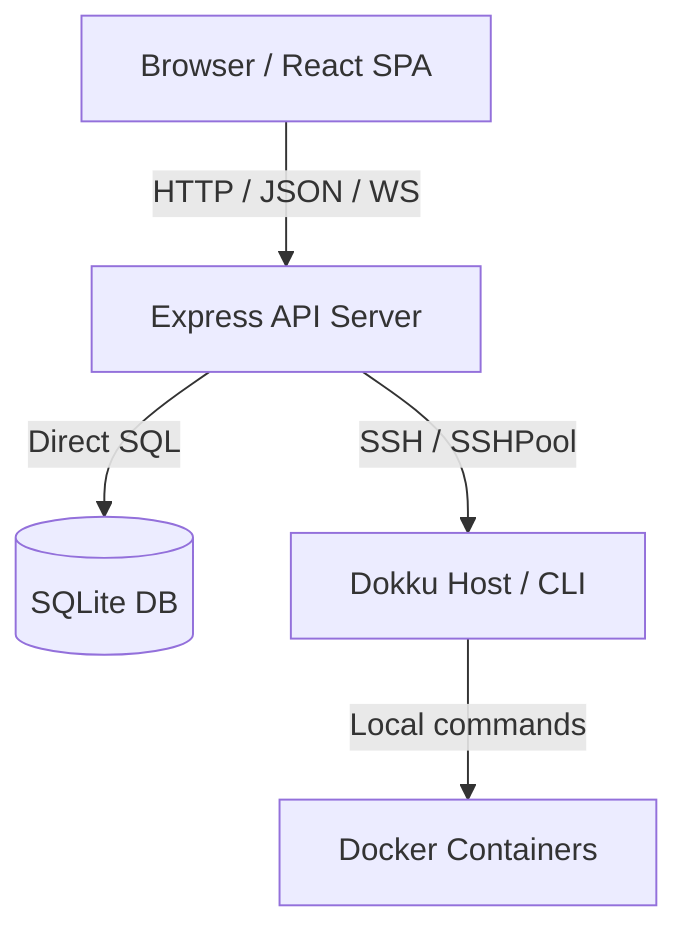
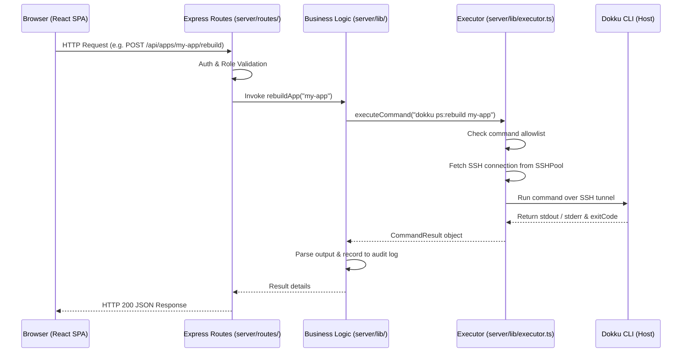
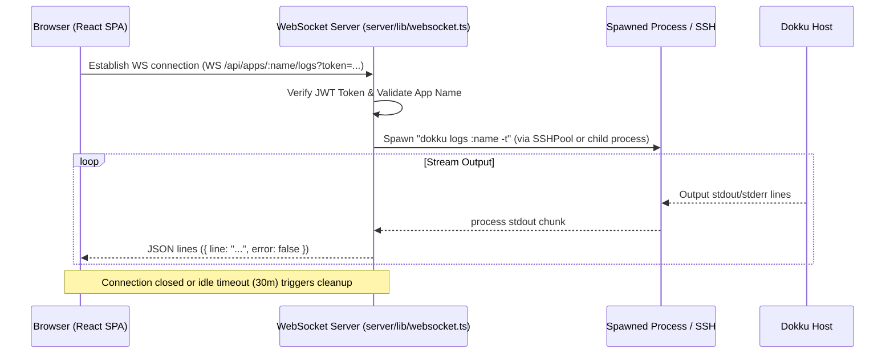

# Architecture

**Analysis Date:** 2026-06-29

## Pattern Overview

**Pattern:** Client-Server with SSH Orchestration

Docklight operates as a self-hosted single-node admin dashboard. It uses a clean separation between the frontend SPA client and the backend server, orchestrating server actions through SSH execution to the Dokku command-line interface.

### Key Architectural Characteristics:
*   **Decoupled Client & Server:** A React SPA frontend communicates with an Express API backend via REST and WebSockets.
*   **Agentic / CLI Wrapper Pattern:** Rather than interacting directly with Docker APIs, Docklight wraps the Dokku CLI over SSH.
*   **Stateful Backend:** Ephemeral state (caching, connection pools) is kept in Express memory; persistent state (users, audits, settings) is in SQLite.
*   **Real-time Streaming:** WebSockets stream live logs (`dokku logs -t`) and distribute application events in real-time.

---

## Layers

### 1. Presentation Layer (Client)
*   **Location:** [client/src/](file:///Users/huynhdung/src/tries/2026-06-28-jellydn-docklight-pr-137/client/src/)
*   **Key Tech:** React, Vite, Tailwind CSS 4, Radix UI Primitives, Lucide icons.
*   **State Management:** `@tanstack/react-query` handles server state synchronization. React Context manages authentication session state.
*   **Responsibilities:** Rendering UI pages (Dashboard, Apps, Databases, Plugins, Audits, Users, Settings), handling forms, validating client inputs, and managing WebSocket connections for live logs.

### 2. API Layer (Server Routes)
*   **Location:** [server/routes/](file:///Users/huynhdung/src/tries/2026-06-28-jellydn-docklight-pr-137/server/routes/)
*   **Key Tech:** Express Router.
*   **Responsibilities:** Mapping HTTP request paths to controllers, enforcing JWT-based route authentication and Role-Based Access Control (RBAC) middleware, parsing query params, and structuring JSON API responses.

### 3. Business Logic Layer
*   **Location:** [server/lib/](file:///Users/huynhdung/src/tries/2026-06-28-jellydn-docklight-pr-137/server/lib/)
*   **Key Tech:** Node.js, `node-ssh`, SQLite helpers, event emitters.
*   **Responsibilities:** Orchestrating Dokku CLI commands, parsing CLI text outputs into clean JSON response formats, checking command execution rules against safety allowlists, maintaining SSH connections, and executing database queries.

### 4. Data Layer (Database & Storage)
*   **Location:** [server/lib/db.ts](file:///Users/huynhdung/src/tries/2026-06-28-jellydn-docklight-pr-137/server/lib/db.ts) / [server/data/](file:///Users/huynhdung/src/tries/2026-06-28-jellydn-docklight-pr-137/server/data/)
*   **Key Tech:** `better-sqlite3` (SQLite engine).
*   **Responsibilities:** Direct SQL operations using prepared statements, transaction safety, database migration checks (`IF NOT EXISTS`, automatic column additions), and database write throttling/indexing.

---

## Data Flow

### Request-Response Flow

### Real-Time WebSocket Streaming Flow

---

## Key Abstractions

### 1. Command Execution & SSHPool
*   **File:** [executor.ts](file:///Users/huynhdung/src/tries/2026-06-28-jellydn-docklight-pr-137/server/lib/executor.ts)
*   **Details:** Encapsulates the execution of CLI commands.
*   **Abstraction:** If `DOCKLIGHT_DOKKU_SSH_TARGET` is set, it executes commands over an SSH connection pool (`SSHPool`). Otherwise, it spawns local shell commands.
*   **CommandResult Interface:** Always returns `{ command: string, exitCode: number, stdout: string, stderr: string }`.

### 2. Command Allowlist
*   **File:** [allowlist.ts](file:///Users/huynhdung/src/tries/2026-06-28-jellydn-docklight-pr-137/server/lib/allowlist.ts)
*   **Details:** Hard security boundary. Splits incoming commands on pipe operators (`|`) and checks each sub-command's base executable against a strict set of permitted commands (`dokku`, `top`, `free`, `df`, `grep`, `awk`, `curl`).

### 3. Real-Time Application Events
*   **File:** [app-events.ts](file:///Users/huynhdung/src/tries/2026-06-28-jellydn-docklight-pr-137/server/lib/app-events.ts)
*   **Details:** Ephemeral publish-subscribe bridge. Allows backend controllers to broadcast app actions (e.g. scaling, building) to connected WebSockets under `/api/events`.

### 4. Database Engine wrapper
*   **File:** [db.ts](file:///Users/huynhdung/src/tries/2026-06-28-jellydn-docklight-pr-137/server/lib/db.ts)
*   **Details:** Configures SQLite features like WAL journal mode, synchronous mode, and foreign keys. Handles user roles, audit logging, reset tokens, and command history logging.

---

## Entry Points

### 1. Backend Server Entry Point
*   **File:** [server/index.ts](file:///Users/huynhdung/src/tries/2026-06-28-jellydn-docklight-pr-137/server/index.ts)
*   **Command:** `bun run server-dev` (development) or `bun start` (production)
*   **Responsibilities:** Boots Express app, runs database checks, starts background audit log rotation, mounts HTTP middleware/routes, sets up the WebSocket handler, and captures signal listeners (`SIGINT`/`SIGTERM`) for graceful shutdowns.

### 2. Frontend Client Entry Point
*   **File:** [client/src/main.tsx](file:///Users/huynhdung/src/tries/2026-06-28-jellydn-docklight-pr-137/client/src/main.tsx)
*   **Command:** `bun run client-dev` (development) or `bun run build` (production)
*   **Responsibilities:** Mounts the React DOM root, initializes the TanStack query client (`QueryClientProvider`), and sets up theme/style configs.

### 3. User Setup CLI Utility
*   **File:** [server/createUser.ts](file:///Users/huynhdung/src/tries/2026-06-28-jellydn-docklight-pr-137/server/createUser.ts)
*   **Command:** `bun run server/createUser.ts <username> <password> <role>`
*   **Responsibilities:** Bypasses HTTP APIs to seed initial administrators or operators into the database directory.

---

## Error Handling & Reliability

*   **Fail-Closed Auth Safety:** If running outside development or test modes, the server will crash on startup if `JWT_SECRET` is not set.
*   **Graceful Exit Code Handlers:** The execution wrappers translate common warnings (e.g., SSH Permanently Added hosts warning) into `exitCode: 0` instead of letting them propagate as fatal execution failures.
*   **Rate Limiting Protection:** Rate-limiting via sliding windows prevents brute force login attacks and API overload. Expensive CLI actions are blocked with `HTTP 429` responses if thresholds are crossed.
*   **Retry with Backoff:** SSH connection handshakes employ retry-with-backoff algorithms to survive intermittent packet loss during remote host connects.
